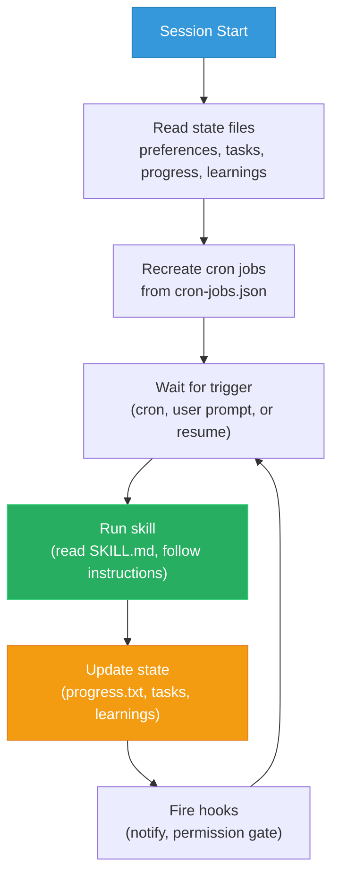

# Architecture

This repo is a forkable template for building an autonomous developer agent with [Claude Code](https://claude.ai/claude-code). Everything is file-based -- no database, no cloud service beyond the APIs your skills call. The agent reads markdown instructions, maintains state in plain files, and runs skills on cron schedules. Git is the audit trail.

## The Autonomy Loop

Every agent action follows one cycle: read state, decide, act, update state.



## Files Reference

| File | What | Why | How |
|------|------|-----|-----|
| `CLAUDE.md` | Master instruction set | Single source of truth for agent behavior | Read at session start + after compaction |
| `preferences.md` | User identity, style, don'ts | Personalizes the agent to you | Edit manually; agent appends corrections |
| `tasks-active.md` | Current work items | Agent knows what to work on | Agent adds/removes; you edit priorities |
| `tasks-completed.md` | Done items archive | Context for standups and daily reviews | Append-only; tasks move here when done |
| `progress.txt` | Action log | Audit trail of everything the agent did | Append-only; both you and agent write |
| `error-log.md` | Past mistakes | Agent reads at startup to avoid repeating | Agent appends inline when corrected |
| `learnings.md` | Patterns, mistakes, preferences | Compound improvement over time | Agent appends inline; learning-loop consolidates |
| `priority-map.md` | P0-P3 priority definitions | Agent ranks work consistently | Edit manually to match your workflow |
| `cron-jobs.json` | Scheduled skill definitions | Skills run on autopilot | Edit to add/remove/reschedule skills |

## Hooks

Hooks are shell scripts that fire automatically on Claude Code events. Exit codes control behavior: **0** = continue, **1** = warn, **2** = block the operation.

This repo includes two hooks:

- **`stop-telegram.sh`** -- Fires on `Stop` (agent finishes a response). Sends a Telegram message with the last output. Requires `TELEGRAM_BOT_TOKEN` and `TELEGRAM_CHAT_ID` env vars. Exits 0 (never blocks).

- **`permission-gate.sh`** -- Fires on `PreToolUse` (before any tool call). Blocks force pushes to main/master and recursive deletes from root (exit 2). Everything else passes (exit 0).

Hooks are registered in `.claude/settings.local.json` (included in this repo). To enable Telegram notifications, set the `TELEGRAM_BOT_TOKEN` and `TELEGRAM_CHAT_ID` environment variables.

## Skills

Every skill is a `SKILL.md` file with four sections:

1. **Input** -- what files to read before acting
2. **Process** -- step-by-step instructions
3. **Output** -- what to produce
4. **State Update** -- what files to update when done

Skills communicate through shared state files, not by calling each other directly. The git reviewer writes to progress.txt; the standup generator reads it the next morning.

| Skill | Schedule | What It Does |
|-------|----------|-------------|
| `daily-planner` | 5:33 PM | Reviews tasks, scores the day 1-10, plans tomorrow |
| `pr-reviewer` | 9 AM, 1 PM, 5 PM | Queries open PRs via `gh`, flags size/security/staleness risks |
| `git-reviewer` | Noon | Summarizes commits with WHAT/WHY/IMPACT analysis |
| `standup-generator` | 8:30 AM weekdays | Composes a ready-to-paste standup from agent data |
| `meeting-ingest` | 6:37 PM | Extracts action items and decisions from meeting transcripts |
| `learning-loop` | 11:47 PM | Consolidates daily corrections, promotes repeated patterns |
| `heartbeat` | Every 2h | Checks cron health, state validity, task deadlines, failures |

## Scheduling

Cron jobs are defined in `cron-jobs.json`. Each entry has a name, cron expression, skill reference, and status.

Cron jobs expire after 7 days. If your agent restarts after a gap, stale jobs do not pile up. The heartbeat skill runs every 2 hours and recreates any expired crons via CronCreate.

At session startup, the agent reads `cron-jobs.json` and recreates all active jobs. Config in JSON is not activation -- the agent must create the actual cron jobs.

## Self-Healing

The heartbeat skill is the safety net. Every 2 hours it checks:
- Are all cron jobs alive and within expiry?
- Is progress.txt fresh (updated in the last 24h)?
- Are there overdue or stale tasks?
- Are there unresolved entries in failed-jobs.log?
- Can all state files be parsed?
- Do all referenced SKILL.md files exist?

If something is wrong, the heartbeat can autonomously recreate expired crons (via CronCreate — expired jobs are deleted, not paused), retry failed jobs (once), and re-read critical files. It cannot delete files, modify skill logic, or push code -- those require human approval.

## Adding a New Skill

Tell Claude Code what you need:

```
Create a new skill called "{name}" that {description}.
It should run {schedule}. Follow the same SKILL.md pattern
as the existing skills (Input, Process, Output, State Update).
Add it to cron-jobs.json and register it with the heartbeat.
```

Claude Code will create the skill file, update the cron config, and add it to the heartbeat's verification list. Test it manually first ("Run the {name} skill"), then monitor `progress.txt` and `failed-jobs.log` for the first few scheduled runs.

## Running Persistently

The agent needs a session that stays alive. **tmux** keeps your terminal running after disconnect — your agent survives laptop close, SSH drops, and sleep.

```bash
brew install tmux                    # macOS (or: sudo apt install tmux)
tmux new -s agent                    # start a session
claude                               # run the agent inside tmux
# Ctrl+B then D to detach. tmux attach -t agent to reattach.
```

This isn't just for the agent — any project, build, or process you run inside tmux stays alive. The agent is one of many things you can keep running.

### Remote Access

**Tailscale** gives your devices a mesh VPN — SSH from your phone to your machine without port forwarding or static IPs.

```bash
brew install tailscale && sudo tailscale up    # authenticate via browser
```

**Termius** (iOS/Android) is a mobile SSH client. Connect using your Tailscale IP, then `tmux attach -t agent` — you're in your agent session from your phone.

## Customization

Everything in this system is replaceable. Swap components without changing the architecture:

| Component | Default | Alternatives |
|-----------|---------|-------------|
| Notifications | Telegram | Slack webhook, Discord, Pushover, ntfy, email |
| Git hosting | GitHub (`gh` CLI) | GitLab (`glab`), Bitbucket, Azure DevOps |
| Persistent session | tmux | screen, Zellij, VS Code remote |
| Remote access | Tailscale | Cloudflare Tunnel, ngrok, WireGuard |

To swap: update the relevant skill's Process section and `preferences.md`. The architecture stays the same.
