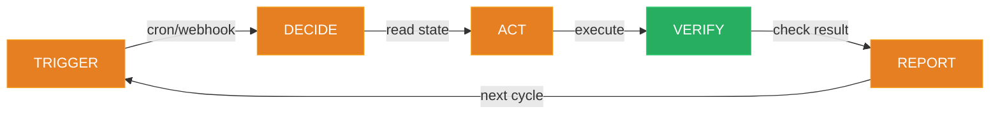

# Lesson 01 -- What Is a Dev Agent

You are about to build a personal developer agent. Not a chatbot. Not an autocomplete tool. An autonomous system that runs on your machine, monitors your work, makes decisions, and reports back to your phone.

This lesson is observation only. You will not build anything yet. You will see the finished system, understand the mental model, and know exactly what you are working toward.

---

## The Finished Agent

Here is the `.claude/` directory of a fully operational dev agent:

```
.claude/
  CLAUDE.md                  # Master instruction file -- the agent's brain
  preferences.md             # Who you are, your calendars, your don'ts
  tasks-active.md            # Work in progress
  tasks-completed.md         # Done items
  progress.txt               # Append-only action log
  learnings.md               # Patterns, mistakes, preferences
  error-log.md               # Past mistakes -- never repeat
  auto-resolver.md           # What to decide alone vs escalate
  priority-map.md            # 4 priority levels with rules
  cron-jobs.json             # 7 scheduled jobs
  failed-jobs.log            # Dead-letter queue
  hooks/
    stop-telegram.sh         # Sends notification when agent finishes
  skills/
    daily-planner/SKILL.md
    pr-reviewer/SKILL.md
    git-reviewer/SKILL.md
    standup-generator/SKILL.md
    meeting-ingest/SKILL.md
    learning-loop/SKILL.md
    browser-verify/SKILL.md
    heartbeat/SKILL.md
```

This agent has 7 scheduled jobs running. It sends Telegram notifications when tasks finish. It monitors GitHub repos, reviews PRs, generates standups, ingests meeting transcripts, and self-heals when something breaks. It learns from corrections and gets better every week.

---

## The Autonomy Loop

Every agent action follows the same cycle:

```
Trigger --> Read State --> Decide --> Act --> Verify --> Update State --> Report
```



1. **Trigger** -- A cron fires, a user prompt arrives, or another skill calls this one.
2. **Read State** -- The agent reads its state files to understand the current situation.
3. **Decide** -- Based on priority-map.md and auto-resolver.md, it determines what to do and whether it needs approval.
4. **Act** -- It executes: generates a draft, queries an API, writes code, runs a tool.
5. **Verify** -- It checks its own work. Did the file get created? Does the output make sense?
6. **Update State** -- It writes results to the appropriate state files. progress.txt gets a new line. tasks-active.md gets updated.
7. **Report** -- It sends a notification. Telegram, Slack, or just a log entry.

This loop is the universal pattern. Every skill you build in this course follows it. The daily planner follows it. The PR reviewer follows it. The heartbeat follows it. The structure never changes -- only the trigger and the action differ.

---

## Chatbot vs Agent

| Dimension | Chatbot | Dev Agent |
|---|---|---|
| **Trigger** | You type a message | Cron job, webhook, or another skill |
| **Memory** | Conversation window only | File-based state that persists across sessions |
| **Autonomy** | Does exactly what you ask | Reads rules, decides what to do, acts within boundaries |
| **Learning** | Forgets between sessions | Writes corrections to files, never repeats mistakes |
| **Monitoring** | None | Heartbeat checks itself every 2 hours |
| **Recovery** | You restart the conversation | Agent detects failures, retries, logs to dead-letter queue |
| **Scope** | Single task | 7+ concurrent scheduled workflows |

A chatbot is a tool you use. An agent is a system that works for you.

---

## What Makes This Possible

Three things make Claude Code suitable for this:

**1. CLAUDE.md -- The Instruction File**

Claude Code reads a `CLAUDE.md` file at session startup. This is your agent's master instruction set. It defines what to read, what rules to follow, and how to behave. Without it, you have a chatbot. With it, you have an agent.

**2. Hooks -- Deterministic Behavior**

Claude Code supports hooks: shell scripts or commands that fire on specific events. When the agent finishes a task, a hook sends a Telegram message. When it is about to execute a dangerous tool, a hook can block it. Hooks make behavior predictable and safe.

**3. File-Based State -- No Database Required**

Every piece of agent state lives in plain text files inside `.claude/`. Tasks, progress, learnings, errors, schedules -- all readable, all version-controlled, all portable. You can inspect the agent's entire brain by reading a directory.

---

## The 7 Scheduled Jobs

Here is what the finished agent runs on autopilot:

| Job | Schedule | What It Does |
|---|---|---|
| Daily Planner | 5:33 PM | Reviews calendar, scores the day, plans tomorrow |
| Git Reviewer | Noon | Summarizes commits across your repos |
| PR Reviewer | 3x daily | Monitors open PRs, flags risks |
| Standup Generator | 8 AM | Generates daily standup from tasks and progress |
| Meeting Ingest | 6:37 PM | Extracts action items from meeting transcripts |
| Learning Loop | 11:47 PM | Consolidates corrections into permanent rules |
| Heartbeat | Every 2h | Self-checks: crons alive, state valid, no stale tasks |

Browser Verify is an on-demand skill -- called by other skills after changes, not on a schedule.

---

## What You Will Build

Over the next 10 lessons, you will construct this entire system from scratch:

- **Lesson 02** -- CLAUDE.md and state files. The agent's foundation.
- **Lesson 03** -- Hooks. Telegram notifications and safety gates.
- **Lesson 04** -- Memory. Inline learning, error tracking, autonomy rules.
- **Lesson 05** -- Skills and scheduling. Your first cron job.
- **Lesson 06** -- PR review agent. Monitoring GitHub.
- **Lesson 07** -- Git reviewer and standup generator. Two skills, same pattern.
- **Lesson 08** -- Meeting ingest and failure handling. Graceful degradation.
- **Lesson 09** -- Heartbeat. The self-healing safety net.
- **Lesson 10** -- Access your agent from anywhere. Persistent sessions and remote access.
- **Lesson 11** -- Ship it. Full system review, customization, deployment.

By lesson 11, you will have built all of this.

---

## Fork It

Before you start building, think about your own workflow:

- What notifications do you want on your phone? Telegram? Slack? Discord?
- What repos do you need monitored?
- Do you have meeting transcripts to ingest?
- What does your daily standup look like?
- What recurring tasks could be automated?

The system you build will be personal. The architecture is universal. The skills are yours to customize.

Next lesson: you start building.
