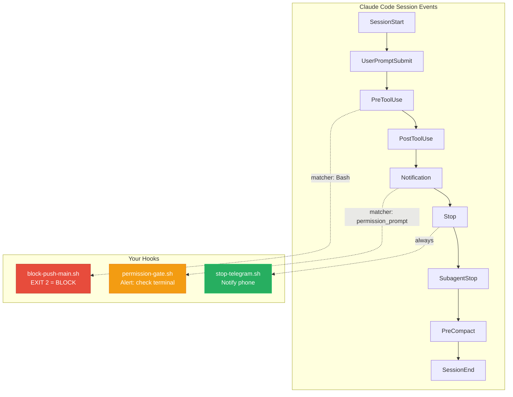

# Lesson 03 -- Hooks: Making It Deterministic

A hook is a command that fires automatically when a specific event occurs in Claude Code. The agent does not choose whether to run a hook -- it runs every time the event fires. This is what makes behavior deterministic instead of probabilistic.

---

## Where You Are

```
your-project/
  CLAUDE.md
  .claude/
    preferences.md
    tasks-active.md
    progress.txt
```

---

## See It: The 9 Claude Code Events

Claude Code emits events at specific points during a session. You can attach hooks to any of them.

| Event | When It Fires |
|---|---|
| `SessionStart` | Agent session begins |
| `UserPromptSubmit` | User sends a prompt (before processing) |
| `PreToolUse` | Before the agent calls any tool (bash, write, etc.) |
| `PostToolUse` | After a tool call completes |
| `Notification` | Agent generates a notification |
| `Stop` | Agent finishes its response |
| `SubagentStop` | A sub-agent finishes |
| `PreCompact` | Before context compaction |
| `SessionEnd` | Session is closing |



The two most useful events for your first agent: `Stop` (send a notification when work finishes) and `PreToolUse` (block dangerous operations).

## See It: Hook Types

Each hook has a type that determines what it does:

| Type | What It Does |
|---|---|
| `command` | Runs a shell command. This is the primary type you will use. |
| `prompt` | Injects a prompt into the conversation. |
| `agent` | Spawns a sub-agent to handle the event. |
| `http` | Sends an HTTP request to a URL. |

For this course, you will use `command` hooks almost exclusively. They are simple, testable, and debuggable.

## See It: Exit Codes

When a hook runs, its exit code determines what happens next:

| Exit Code | Meaning |
|---|---|
| `0` | Success -- continue normally |
| `1` | Warning -- show a message but continue |
| `2` | Block -- stop the operation entirely |

Exit code 2 is your safety net. A `PreToolUse` hook that exits with code 2 will prevent the tool from executing. This is how you stop the agent from doing something dangerous.

## See It: Matchers

Hooks can use matchers to fire only on specific tools. The `tool_name` matcher takes a regex pattern:

```json
{
  "matcher": {
    "tool_name": "^Bash$"
  }
}
```

This hook fires only when the agent is about to use the Bash tool. Without a matcher, the hook fires on every event of that type.

---

## Build It: Telegram Notification Hook

When your agent finishes a task, you want to know about it. This hook sends a Telegram message every time Claude Code reaches a `Stop` event.

**Prerequisites:**
- You need a Telegram bot token and your chat ID. Create a bot via @BotFather on Telegram and send it a message to get your chat ID.
- You need `jq` installed. The hook scripts use it to parse JSON input from Claude Code. Install it with `brew install jq` (macOS) or `apt install jq` (Linux).

**Intent:** Create a shell script that sends a Telegram notification when the agent stops.

**Prompt for Claude Code:**

```
Create the file .claude/hooks/stop-telegram.sh with the following content.
Make it executable.

#!/bin/bash

TELEGRAM_BOT_TOKEN="${TELEGRAM_BOT_TOKEN}"
TELEGRAM_CHAT_ID="${TELEGRAM_CHAT_ID}"

if [ -z "$TELEGRAM_BOT_TOKEN" ] || [ -z "$TELEGRAM_CHAT_ID" ]; then
  exit 0
fi

# Read the stop hook input from stdin
INPUT=$(cat)
STOP_REASON=$(echo "$INPUT" | jq -r '.stop_reason // "unknown"')

MESSAGE="Agent finished. Reason: ${STOP_REASON}"

curl -s -X POST "https://api.telegram.org/bot${TELEGRAM_BOT_TOKEN}/sendMessage" \
  -d chat_id="$TELEGRAM_CHAT_ID" \
  -d text="$MESSAGE" \
  -d parse_mode="Markdown" > /dev/null 2>&1

exit 0
```

**Expected output:** An executable script at `.claude/hooks/stop-telegram.sh`.

---

## Build It: Permission Gate Hook

This hook fires before any tool use and blocks dangerous operations unless you have explicitly allowed them.

**Intent:** Create a hook that warns on file deletion and blocks pushes to main.

**Prompt for Claude Code:**

```
Create the file .claude/hooks/permission-gate.sh with the following content.
Make it executable.

#!/bin/bash

# Reads PreToolUse hook input from stdin
INPUT=$(cat)
TOOL_NAME=$(echo "$INPUT" | jq -r '.tool_name // ""')
TOOL_INPUT=$(echo "$INPUT" | jq -r '.tool_input // {}')

# Block force pushes to main/master
if [ "$TOOL_NAME" = "Bash" ]; then
  COMMAND=$(echo "$TOOL_INPUT" | jq -r '.command // ""')
  if echo "$COMMAND" | grep -qE 'git\s+push.*--force.*(main|master)'; then
    echo "BLOCKED: Force push to main/master is not allowed."
    exit 2
  fi
  if echo "$COMMAND" | grep -qE 'rm\s+-rf\s+/'; then
    echo "BLOCKED: Recursive delete from root is not allowed."
    exit 2
  fi
fi

exit 0
```

**Expected output:** An executable script at `.claude/hooks/permission-gate.sh`.

---

## Build It: Register Hooks in Settings

Hooks are registered in `.claude/settings.local.json`. This file tells Claude Code which hooks to run and when.

**Intent:** Create the settings file that wires up both hooks.

**Prompt for Claude Code:**

```
Create .claude/settings.local.json with this content:

{
  "hooks": {
    "Stop": [
      {
        "type": "command",
        "command": "bash .claude/hooks/stop-telegram.sh"
      }
    ],
    "PreToolUse": [
      {
        "type": "command",
        "command": "bash .claude/hooks/permission-gate.sh"
      }
    ]
  }
}
```

**Expected output:** A JSON settings file at `.claude/settings.local.json`.

---

## Build It: Test Your Hooks

**Intent:** Verify the Telegram hook works by running it manually.

**Prompt for Claude Code:**

```
Test the stop-telegram hook by running it manually:

echo '{"stop_reason": "end_turn"}' | bash .claude/hooks/stop-telegram.sh

If TELEGRAM_BOT_TOKEN and TELEGRAM_CHAT_ID are set in your environment,
you should receive a Telegram message. If they are not set, the script
should exit silently with code 0.
```

**Intent:** Verify the permission gate blocks force pushes.

**Prompt for Claude Code:**

```
Test the permission gate by running:

echo '{"tool_name": "Bash", "tool_input": {"command": "git push --force origin main"}}' | bash .claude/hooks/permission-gate.sh
echo "Exit code: $?"

Expected: prints "BLOCKED: Force push to main/master is not allowed." and
exit code 2.
```

---

## Checkpoint

Your `.claude/` directory should now contain: `preferences.md`, `tasks-active.md`, `progress.txt`, `settings.local.json`, `hooks/stop-telegram.sh`, `hooks/permission-gate.sh`.

---

## Fork It

- **Slack instead of Telegram?** Replace the curl call in `stop-telegram.sh` with a Slack webhook POST. Same structure, different URL.
- **Discord?** Use a Discord webhook URL. The payload format changes slightly, but the hook pattern stays identical.
- **More safety gates?** Add checks for `rm -rf`, `DROP TABLE`, or any command you consider dangerous. Each check is an `if` block that exits with code 2.
- **Audit logging?** Add a `PostToolUse` hook that appends every tool call to a log file. Full visibility into what the agent does.

Next lesson: you give the agent a learning system so it remembers its mistakes and improves over time.
