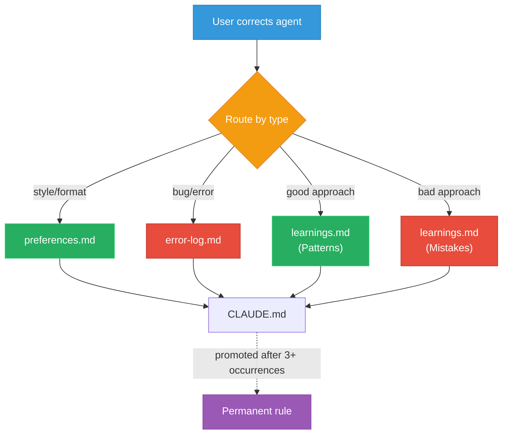

# Lesson 04 -- Memory and Inline Learning

When you correct the agent, it writes the correction to a file immediately -- not at the end of the day, not on a cron schedule, but in the same turn. This is inline learning, and it is what separates a useful agent from one you have to retrain every session.

---

## Where You Are

```
your-project/
  CLAUDE.md
  .claude/
    preferences.md
    tasks-active.md
    progress.txt
    settings.local.json
    hooks/
      stop-telegram.sh
      permission-gate.sh
```

---

## See It: The Learning System

The agent maintains three files for learning:

| File | What Goes In It | When It Gets Updated |
|---|---|---|
| `error-log.md` | Mistakes the agent made | When you correct an error |
| `learnings.md` | Patterns that work, approaches that failed | When a task succeeds or fails |
| `auto-resolver.md` | What the agent can decide alone vs must escalate | When autonomy boundaries change |

The critical rule: **learn immediately, in the same turn as the correction.** If the user says "don't format code that way," the agent does two things: (1) fixes the formatting, and (2) appends the rule to preferences.md. Same turn. No delay.

## See It: The Routing Logic

Different corrections go to different files:

| Correction Type | Destination File |
|---|---|
| "Don't do X" | `.claude/preferences.md` (Don'ts section) |
| Style or format correction | `.claude/preferences.md` |
| Bug or error the agent made | `.claude/error-log.md` |
| Approach that worked well | `.claude/learnings.md` (Patterns section) |
| Approach that failed | `.claude/learnings.md` (Mistakes section) |
| "You should ask me before doing X" | `.claude/auto-resolver.md` |

This routing is defined in CLAUDE.md. The agent reads the rules and follows them. You do not need to tell it which file to update -- it routes automatically based on the type of correction.



## See It: Why Not Just Use a Cron?

Inline learning captures corrections immediately, before context compaction can erase them and before the agent repeats the same mistake. The daily Learning Loop cron is for consolidation -- reviewing the day and promoting repeated patterns. They supplement each other: inline for real-time capture, cron for nightly review.

---

## Build It: Error Log

**Intent:** Create the file where the agent records its mistakes so it never repeats them.

**Prompt for Claude Code:**

```
Create .claude/error-log.md with this content:

# Error Log

Record every mistake here. Read this file at session startup. Never repeat
a logged error.

## Format

Each entry:
- Date
- What happened
- What should have happened
- Root cause

## Errors

(none yet)
```

**Expected output:** An error log file ready for entries.

---

## Build It: Learnings File

**Intent:** Create the file where the agent tracks what works and what does not.

**Prompt for Claude Code:**

```
Create .claude/learnings.md with this content:

# Learnings

Accumulated patterns and mistakes. Read at session startup. Updated inline
whenever a task succeeds or fails in a notable way.

## Patterns (What Works)

(none yet)

## Mistakes (What Failed)

(none yet)

## Preferences Discovered

(none yet)
```

**Expected output:** A learnings file with three empty sections.

---

## Build It: Auto-Resolver

The auto-resolver defines the agent's autonomy boundaries. It answers: "Can I do this on my own, or do I need to ask?"

**Intent:** Create the autonomy boundary file.

**Prompt for Claude Code:**

```
Create .claude/auto-resolver.md with this content:

# Auto-Resolver

Rules for what the agent can decide alone vs what needs human approval.

## Autonomous (Do It)

- Generate drafts and outlines
- Read and query data from APIs
- Update state files (tasks, progress, learnings)
- Run read-only git commands (status, log, diff)
- Schedule jobs via cron-jobs.json
- Create or update skill files
- Run tests

## Needs Approval

- Push code to any remote repository
- Send messages to anyone (email, Slack, Telegram on behalf of user)
- Create or modify calendar events
- Publish to external platforms
- Delete any file or data
- Modify CI/CD pipelines
- Run commands with side effects on production systems

## When Unsure

If an action does not clearly fall into either category:
1. Default to asking for approval
2. Log the ambiguity in learnings.md
3. If the user says "just do it," add the action to the Autonomous list
```

**Expected output:** A clear boundary file for agent autonomy.

---

## Build It: Update CLAUDE.md with Learning Rules

Now wire the learning system into the master instruction file.

**Intent:** Add inline learning rules to CLAUDE.md so the agent knows how to route corrections.

**Prompt for Claude Code:**

```
Append the following section to CLAUDE.md:

## Inline Learning (CRITICAL)

Learning happens in real-time, not on a cron schedule.

When the user corrects you:
1. Do what they asked
2. Immediately append to the right file IN THE SAME TURN:
   - Style/format correction --> .claude/preferences.md
   - "Don't do X" --> .claude/preferences.md (Don'ts section)
   - Bug/error you made --> .claude/error-log.md
   - Approach that worked well --> .claude/learnings.md (Patterns)
   - Approach that failed --> .claude/learnings.md (Mistakes)
   - Autonomy boundary change --> .claude/auto-resolver.md

When you complete a task:
- Append one line to progress.txt
- Update tasks-active.md
- If you discovered something useful, append to learnings.md

Rule: Never wait for a cron job to learn. Learn immediately.

## Autonomy Rules

See .claude/auto-resolver.md for full rules. Summary:
- Autonomous: generate drafts, query data, update state files, schedule jobs
- Needs approval: push code, send messages, create events, publish content
```

**Expected output:** CLAUDE.md now includes inline learning and autonomy sections.

---

## Build It: Update Session Startup

Now that you have three new files, update the session startup in CLAUDE.md to read them.

**Intent:** Add the new files to the session startup checklist in CLAUDE.md.

**Prompt for Claude Code:**

```
Update the Session Startup section of CLAUDE.md. Replace the existing
startup steps with:

## Session Startup

1. Read agent identity + rules:
   - .claude/preferences.md -- who I am and my rules
   - .claude/error-log.md -- past mistakes (read carefully, don't repeat)
   - .claude/auto-resolver.md -- what to decide alone vs escalate

2. Read agent state:
   - .claude/tasks-active.md -- pending work
   - .claude/progress.txt -- recent actions
   - .claude/learnings.md -- accumulated patterns

3. Resume any in-progress work from tasks-active.md
```

**Expected output:** Updated startup section that includes all learning files.

---

## Checkpoint

Your `.claude/` directory should now contain: `preferences.md`, `tasks-active.md`, `progress.txt`, `error-log.md`, `learnings.md`, `auto-resolver.md`, `settings.local.json`, `hooks/stop-telegram.sh`, `hooks/permission-gate.sh`. CLAUDE.md should include inline learning and autonomy sections.

---

## Fork It

- **Stricter autonomy?** Move items from the Autonomous list to Needs Approval. Some teams want the agent to ask before running any tests.
- **Looser autonomy?** If you trust the agent with git pushes to feature branches, move that to Autonomous. Keep main/master protected.
- **Team-specific errors?** Add a section to error-log.md for team-wide mistakes (e.g., "never use the legacy API endpoint").
- **Different learning categories?** Add sections to learnings.md for domain-specific knowledge (e.g., "Infrastructure Patterns" or "Client Preferences").

Next lesson: you build your first skill and set up the scheduling system.
