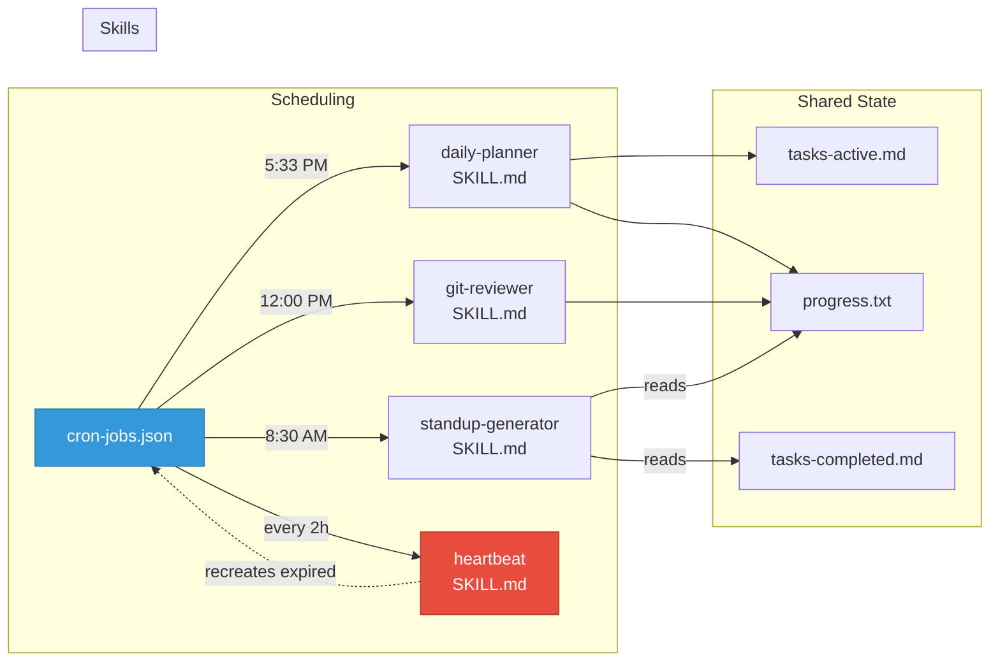

# Lesson 05 -- Skills and Scheduling

A skill is a complete workflow defined in a single markdown file. A cron job triggers that skill on a schedule. Together, they turn your agent from reactive (waits for you) to proactive (works on its own).

---

## Where You Are

```
your-project/
  CLAUDE.md
  .claude/
    preferences.md
    tasks-active.md
    progress.txt
    error-log.md
    learnings.md
    auto-resolver.md
    settings.local.json
    hooks/
      stop-telegram.sh
      permission-gate.sh
```

---

## See It: What Is a Skill

A skill is a SKILL.md file inside `.claude/skills/{skill-name}/`. It defines a complete workflow with four parts:

| Section | What It Contains |
|---|---|
| **Input** | What the skill reads before acting |
| **Process** | Step-by-step instructions for what to do |
| **Output** | What the skill produces |
| **State Update** | What files get updated when the skill finishes |

Every skill follows the same structure. The daily planner reads your calendar and tasks, scores the day, and writes a summary. The git reviewer reads commit history and writes a digest. Different inputs and outputs, identical structure.

Skills are not code. They are instructions. Claude Code reads them and follows them. This means you can edit a skill by editing a markdown file. No redeployment. No compilation.

## See It: How Scheduling Works

The `cron-jobs.json` file defines which skills run and when. Each entry specifies:

```json
{
  "id": "daily-planner",
  "skill": ".claude/skills/daily-planner/SKILL.md",
  "schedule": "33 17 * * *",
  "description": "Daily review and scoring",
  "enabled": true,
  "expires": "7d"
}
```

Key concept: **cron jobs expire after 7 days.** If your agent goes down and comes back up two weeks later, it will not have 14 days of stale cron jobs trying to execute. The heartbeat skill (lesson 09) renews all crons before they expire.

**Important:** `cron-jobs.json` is a convention file, not an OS-level cron system. Claude Code does not execute skills on a schedule by itself. For scheduling to work, you need a running Claude Code session -- typically inside a persistent tmux session (covered in lesson 10). Within that session, you use Claude Code's built-in scheduling (e.g., `/schedule`) to create timed prompts that trigger each skill. The heartbeat skill recreates any expired schedule entries, but it still requires a running Claude Code session to do so.

To run a scheduled skill, you tell Claude Code: "Run the daily-planner skill." Claude Code reads the SKILL.md file, follows the instructions, and updates state.



## See It: Priority Levels

Not all tasks are equal. The priority map defines four levels:

| Level | Meaning | Agent Behavior |
|---|---|---|
| P0 | Critical / Blocking | Drop everything, act immediately, notify |
| P1 | High / Today | Process in current session |
| P2 | Medium / This week | Queue for next available slot |
| P3 | Low / Someday | Log and defer |

When the agent has multiple things to do, it checks priority-map.md to decide what comes first.

---

## Build It: Priority Map

**Intent:** Create the priority system the agent uses to rank work.

**Prompt for Claude Code:**

```
Create .claude/priority-map.md with this content:

# Priority Map

## Levels

### P0 -- Critical
- Production incidents
- Security vulnerabilities
- Blocked deployments
- Action: Drop everything. Act immediately. Notify via Telegram.

### P1 -- High
- Tasks due today
- Open PR reviews assigned to me
- Urgent emails flagged by triage
- Action: Process in current session.

### P2 -- Medium
- Tasks due this week
- Content pipeline stages
- Non-urgent PR reviews
- Action: Queue for next available slot.

### P3 -- Low
- Ideas to explore
- Documentation updates
- Refactoring suggestions
- Action: Log in tasks-active.md. Process when P0-P2 are clear.

## Decision Rules

1. Always process highest priority first
2. Within same priority, process oldest first
3. If two P0 items conflict, notify user and wait for direction
4. Never skip a P0 to work on P2
```

**Expected output:** A priority map file with four levels and decision rules.

---

## Build It: Tasks Completed File

You need somewhere for finished tasks to go. This is the archive.

**Intent:** Create the completed tasks archive.

**Prompt for Claude Code:**

```
Create .claude/tasks-completed.md with this content:

# Completed Tasks

Append-only archive. Tasks move here from tasks-active.md when done.

## Format

Each entry:
- Task ID
- Completed date
- Summary of what was done

## Completed

(none yet)
```

**Expected output:** An empty completed tasks archive.

---

## Build It: Your First Skill -- Daily Planner

**Intent:** Create the daily planner skill that reviews the day and plans tomorrow.

**Prompt for Claude Code:**

```
Create the directory .claude/skills/daily-planner/ and then create
.claude/skills/daily-planner/SKILL.md with this content:

# Daily Planner Skill

Schedule: 5:33 PM daily

## Input

Read these files before processing:
- .claude/tasks-active.md -- current work
- .claude/tasks-completed.md -- what got done today
- .claude/progress.txt -- today's action log
- .claude/preferences.md -- user identity and calendar info

## Process

1. **Review Today**
   - Count tasks completed today (from tasks-completed.md)
   - Count tasks still active (from tasks-active.md)
   - List key actions from progress.txt (today's entries only)

2. **Score the Day**
   - Rate productivity 1-10 based on:
     - Tasks completed vs planned
     - P0/P1 items cleared
     - Any blockers resolved
   - Note what went well
   - Note what could improve

3. **Plan Tomorrow**
   - List carry-over tasks from tasks-active.md
   - Identify top 3 priorities for tomorrow
   - Flag any deadlines within 48 hours

4. **Generate Summary**
   - Format as a concise daily report
   - Include: score, completed count, carry-over count, top 3 tomorrow

## Output

Write the daily report to .claude/daily-reports/[date].md

## State Update

- Append to progress.txt: "[timestamp] -- Daily planner: scored [X]/10,
  [N] tasks completed, [M] carry-over"
- If any task has been active for more than 5 days without progress,
  flag it in the report and add a note to tasks-active.md
```

**Expected output:** A complete skill file at `.claude/skills/daily-planner/SKILL.md`.

---

## Build It: Cron Jobs File

**Intent:** Create the scheduling file with the daily planner as the first entry.

**Prompt for Claude Code:**

```
Create .claude/cron-jobs.json with this content:

[
  {
    "id": "daily-planner",
    "skill": ".claude/skills/daily-planner/SKILL.md",
    "schedule": "33 17 * * *",
    "description": "Daily review, scoring, and tomorrow planning",
    "enabled": true,
    "expires": "7d",
    "last_run": null
  }
]
```

**Expected output:** A cron jobs file with one entry.

---

## Build It: Update CLAUDE.md

**Intent:** Add skill and scheduling awareness to the master instruction file.

**Prompt for Claude Code:**

```
Append the following to CLAUDE.md:

## Skills

Each skill file in .claude/skills/ defines a complete workflow.
When told to "run the [name] skill," read the corresponding SKILL.md
and follow its instructions exactly.

## Scheduling

Cron jobs are defined in .claude/cron-jobs.json. At session startup:
1. Read cron-jobs.json
2. Check which jobs are due
3. Execute due jobs in priority order

Cron jobs expire after 7 days. The heartbeat skill renews them.
```

**Expected output:** CLAUDE.md updated with skill and scheduling sections.

---

## Build It: Test the Daily Planner

**Intent:** Run the skill manually to verify it works.

**Prompt for Claude Code:**

```
Run the daily-planner skill. Read .claude/skills/daily-planner/SKILL.md
and follow its instructions.
```

**Expected output:** A daily report file and an updated progress.txt entry.

---

## Checkpoint

Your `.claude/` directory should now contain: `priority-map.md`, `tasks-completed.md`, `cron-jobs.json`, `skills/daily-planner/SKILL.md` (in addition to all previous files). CLAUDE.md should include skills and scheduling sections.

---

## Fork It

- **Include calendar data?** If you have Google Calendar or Outlook access, add a step that reads today's meetings before scoring.
- **Weekly planner instead?** Create a `weekly-planner/SKILL.md` that runs on Friday afternoon and plans the entire next week.
- **Different scoring criteria?** Modify the scoring section to weight what matters to you: code reviews completed, PRs merged, documentation written.
- **Team daily?** Add steps that pull team standup notes and include them in the summary.

Next lesson: you build a PR review agent that monitors your GitHub repos.
