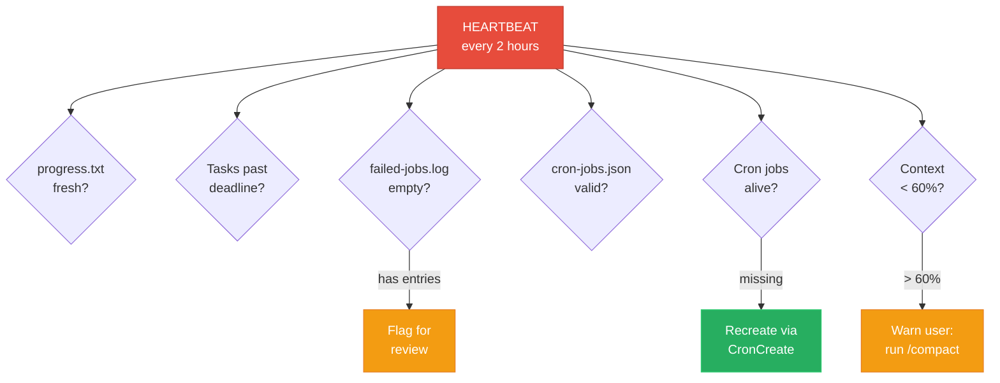

# Lesson 09 -- The Heartbeat: Self-Healing Agent

Who watches the watcher? If a cron job silently expires, if a state file gets corrupted, if tasks go stale -- who catches it? The heartbeat skill runs every 2 hours and checks everything: cron health, state validity, task deadlines, failure accumulation, and context freshness.

---

## Where You Are

```
your-project/
  CLAUDE.md
  .claude/
    preferences.md
    tasks-active.md
    tasks-completed.md
    progress.txt
    error-log.md
    learnings.md
    auto-resolver.md
    priority-map.md
    cron-jobs.json                   # 6 jobs
    failed-jobs.log
    settings.local.json
    hooks/
      stop-telegram.sh
      permission-gate.sh
    skills/
      daily-planner/
        SKILL.md
      pr-reviewer/
        SKILL.md
      git-reviewer/
        SKILL.md
      standup-generator/
        SKILL.md
      meeting-ingest/
        SKILL.md
```

---

## See It: Why Agents Need Self-Monitoring

Cron jobs expire, state goes stale, and context degrades during compaction -- without a heartbeat checking every 2 hours, these problems accumulate silently until something visibly breaks.



## See It: What the Heartbeat Checks

| Check | What It Looks At | Alert Level |
|---|---|---|
| Cron health | Are all crons in cron-jobs.json still within expiry? | HIGH if any expired |
| Progress freshness | When was the last entry in progress.txt? | MEDIUM if >24h, HIGH if >48h |
| Task deadlines | Any tasks in tasks-active.md past their deadline? | HIGH for overdue P0/P1 |
| Failed jobs | Unresolved entries in failed-jobs.log? | MEDIUM if >0, HIGH if >5 |
| State validity | Can all JSON files be parsed? Are markdown files non-empty? | HIGH if corrupt |
| Skill files | Do all referenced SKILL.md files exist? | HIGH if missing |
| Learnings growth | Has learnings.md been updated recently? | LOW informational |

---

## Build It: Heartbeat Skill

**Intent:** Create the self-monitoring skill that checks the health of the entire agent system.

**Prompt for Claude Code:**

```
Create the directory .claude/skills/heartbeat/ and then create
.claude/skills/heartbeat/SKILL.md with this content:

# Heartbeat Skill

Schedule: Every 2 hours

## Input

Read ALL of these files:
- .claude/cron-jobs.json -- check cron health
- .claude/progress.txt -- check freshness
- .claude/tasks-active.md -- check for overdue/stale tasks
- .claude/failed-jobs.log -- check for unresolved failures
- .claude/learnings.md -- check for recent updates
- .claude/error-log.md -- check for recurring errors
- .claude/priority-map.md -- verify parseable
- .claude/preferences.md -- verify parseable

Also verify these skill files exist:
- .claude/skills/daily-planner/SKILL.md
- .claude/skills/pr-reviewer/SKILL.md
- .claude/skills/git-reviewer/SKILL.md
- .claude/skills/standup-generator/SKILL.md
- .claude/skills/meeting-ingest/SKILL.md
- .claude/skills/heartbeat/SKILL.md

## Process

Run these checks in order:

### 1. Cron Health Check
For each entry in cron-jobs.json:
- Parse the "expires" field (default "7d")
- Parse the "last_run" field
- If last_run is null and the job has been in the file for > 7 days,
  flag as EXPIRED
- If last_run is older than the expiry window, flag as EXPIRED
- If the job is enabled but has never run, flag as NEVER_RUN
- For any EXPIRED cron: renew it by updating the expiry window

Result: List of cron statuses (HEALTHY, EXPIRED, NEVER_RUN, DISABLED)

### 2. Progress Freshness Check
- Read the last line of progress.txt
- Parse the timestamp
- Calculate hours since last entry
- If > 24 hours: flag MEDIUM "Progress log stale ({hours}h since
  last entry)"
- If > 48 hours: flag HIGH "Progress log very stale ({hours}h)"

### 3. Task Health Check
For each task in tasks-active.md:
- Check if a deadline is specified
- If overdue: flag by priority (P0/P1 overdue = HIGH, P2 = MEDIUM)
- Check if the task has been active for more than 7 days with no
  progress update
- If stale: flag MEDIUM "Task {id} has been active for {days} days
  with no progress"

### 4. Failed Jobs Check
- Count entries in failed-jobs.log (excluding header lines)
- If > 0: flag MEDIUM "{count} unresolved failures in dead-letter log"
- If > 5: flag HIGH "Failure accumulation: {count} unresolved failures"
- Check for repeated failures (same job_id failing 3+ times):
  flag HIGH "{job} has failed {count} times"

### 5. State Validity Check
- Try to parse cron-jobs.json as JSON. If it fails: flag HIGH
  "cron-jobs.json is corrupt"
- Verify all markdown state files are non-empty
- Check that tasks-active.md has valid structure (has headers,
  tasks are formatted)

### 6. Skill Files Check
- For each skill referenced in cron-jobs.json, verify the SKILL.md
  file exists
- If any are missing: flag HIGH "Skill file missing: {path}"

### 7. Learnings Check (Informational)
- Check last modified date of learnings.md
- If not updated in 7+ days: note "Learnings file has not been updated
  recently -- consider reviewing"

## Output

Generate a health report:

## Agent Health Report -- [date] [time]

### Status: {HEALTHY | DEGRADED | CRITICAL}

CRITICAL = any HIGH flag
DEGRADED = any MEDIUM flag, no HIGH flags
HEALTHY = no flags above LOW

### Checks

| Check | Status | Details |
|---|---|---|
| Cron Health | {status} | {details} |
| Progress Freshness | {status} | {details} |
| Task Health | {status} | {details} |
| Failed Jobs | {status} | {details} |
| State Validity | {status} | {details} |
| Skill Files | {status} | {details} |
| Learnings | {status} | {details} |

### Actions Taken
- {list of auto-remediation actions, e.g., "Renewed expired cron: daily-planner"}

### Recommended Actions
- {list of things that need human intervention}

Write report to .claude/reports/heartbeat-[date]-[time].md

## State Update

- Append to progress.txt: "[timestamp] -- Heartbeat: {STATUS},
  {flag_count} flags ({high}H/{medium}M/{low}L)"
- For any expired crons: update last_run and renew in cron-jobs.json
- If status is CRITICAL: send Telegram notification with the HIGH flags
- If status is DEGRADED: send Telegram notification only if this is
  the 3rd consecutive DEGRADED heartbeat

## Self-Healing Actions

The heartbeat can autonomously fix these issues:
- Renew expired cron jobs (update expiry in cron-jobs.json)
- Re-read critical files after compaction (per CLAUDE.md rules)
- Retry failed jobs from failed-jobs.log (max 1 retry per heartbeat)
- Clear resolved entries from failed-jobs.log (mark with [RESOLVED])

The heartbeat CANNOT autonomously:
- Delete tasks or files
- Modify skill logic
- Change priority levels
- Push code

These require human approval per auto-resolver.md.
```

**Expected output:** A comprehensive heartbeat skill file.

---

## Build It: Add Cron Entry

**Intent:** Schedule the heartbeat to run every 2 hours.

**Prompt for Claude Code:**

```
Add a new entry to .claude/cron-jobs.json:

{
  "id": "heartbeat",
  "skill": ".claude/skills/heartbeat/SKILL.md",
  "schedule": "0 */2 * * *",
  "description": "Self-monitoring: check crons, state, tasks, failures",
  "enabled": true,
  "expires": "7d",
  "last_run": null
}

Keep all existing entries. The file should now have 6 jobs total.
```

**Expected output:** cron-jobs.json with six entries.

---

## Build It: Test the Heartbeat

**Intent:** Run the heartbeat manually to see a baseline health report.

**Prompt for Claude Code:**

```
Run the heartbeat skill. Read .claude/skills/heartbeat/SKILL.md and
follow its instructions. Generate the health report based on the current
state of all files.
```

**Expected output:** A health report showing current system status. On a fresh setup, you should see mostly HEALTHY with possibly some NEVER_RUN cron flags.

---

## Checkpoint

Your `.claude/` directory should now contain: `skills/heartbeat/SKILL.md` and `cron-jobs.json` with 6 jobs (daily-planner, pr-reviewer, git-reviewer, standup-generator, meeting-ingest, heartbeat).

---

## Fork It

- **More frequent heartbeat?** Change to every hour (`0 * * * *`) if you are running many skills and want faster detection.
- **Less frequent?** Every 4 hours (`0 */4 * * *`) is reasonable for lighter workloads.
- **Custom checks?** Add skill-specific health checks. For example: "Is the PR review digest less than 24 hours old?" or "Has the standup been generated today?"
- **Health dashboard?** Write a simple script that reads the latest heartbeat report and displays it as a terminal dashboard.
- **Escalation chain?** First heartbeat failure = log only. Second consecutive failure = Telegram. Third = email. Adjust the notification logic in the State Update section.
- **Team heartbeat?** Add checks for team-shared resources: shared repos, deployment pipelines, shared Slack channels.

Next lesson: you put it all together, review the complete system, and ship it.
